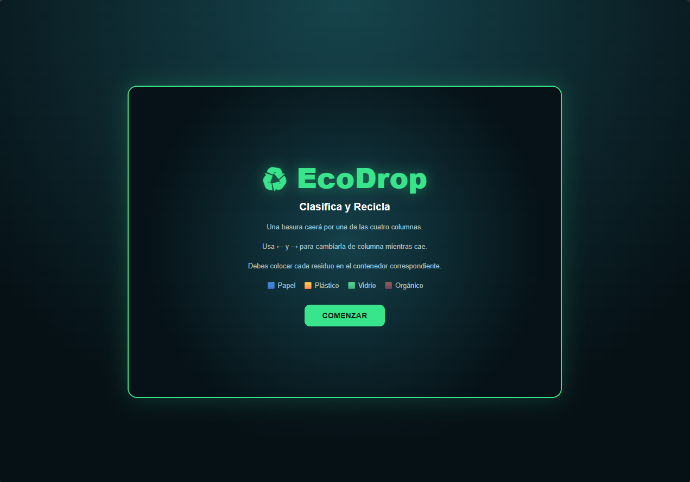
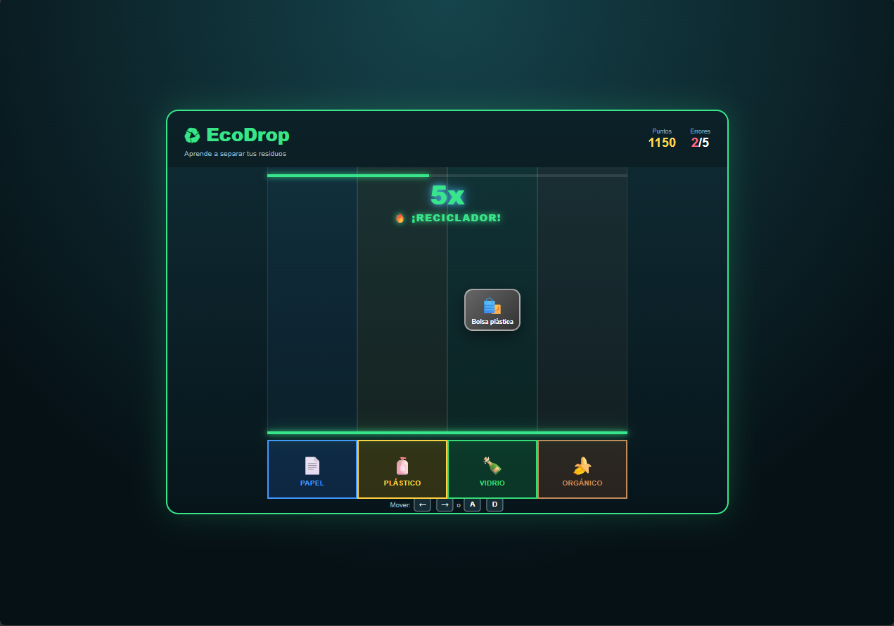

# EcoDrop

## Descripción
EcoDrop es un juego de reflejos al estilo *Guitar Hero* con temática de reciclaje.

**¿De qué trata?** Distintos tipos de basura (papel, plástico, vidrio y orgánico) caen desde la parte superior de la pantalla por una de cuatro columnas.

**¿Cuál es el objetivo del jugador?** Alcanzar la puntuación necesaria para ganar, clasificando cada residuo en el contenedor correcto antes de que llegue al final de la columna.

**¿Cuál es la mecánica principal?** Cambiar de columna el residuo que está cayendo para que coincida con el contenedor de su categoría (🟦 Papel, 🟨 Plástico, 🟩 Vidrio, 🟫 Orgánico) justo antes de que toque el suelo.

## Género
Arcade

## Controles
* A / ← - Mover el residuo a la columna de la izquierda
* D / → - Mover el residuo a la columna de la derecha

## Capturas de pantalla

### Pantalla inicial

### Gameplay - Mecánica principal

