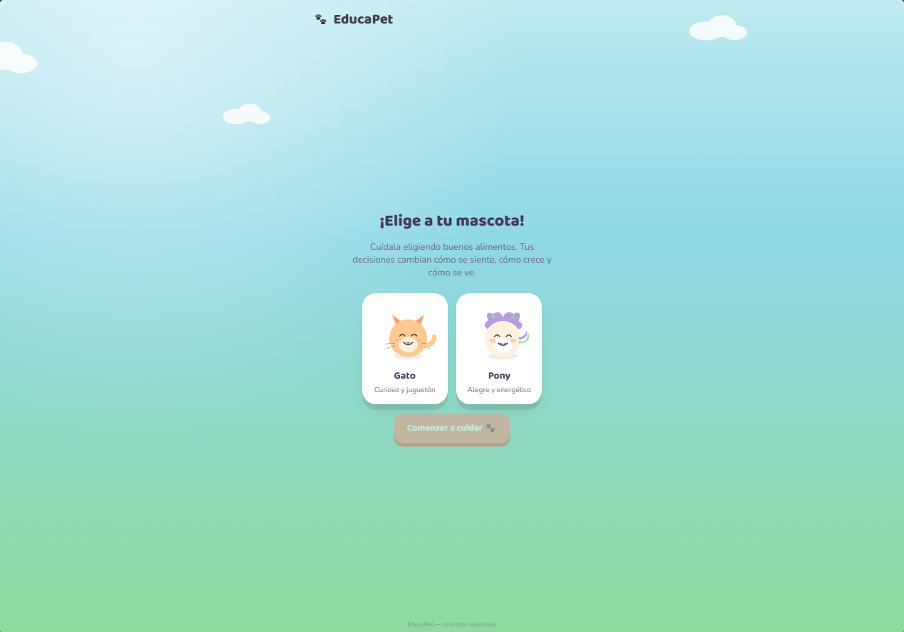
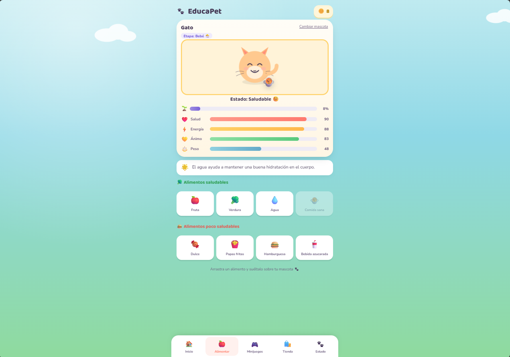

# EducaPet

## Descripción
EducaPet es una versión simplificada del clásico *Pou*, adaptada a la temática de la materia.

**¿De qué trata?** El jugador adopta una mascota virtual a la que debe cuidar alimentándola y entreteniéndola con minijuegos.

**¿Cuál es el objetivo del jugador?** Mantener con vida y feliz a la mascota. Cuidándola bien se ganan monedas que pueden gastarse en ropa y accesorios en la tienda; si se descuida, la mascota muere y termina la partida.

**¿Cuál es la mecánica principal?** Navegar entre las pestañas de Inicio, Alimentar, Minijuegos, Tienda y Estado para gestionar las necesidades de la mascota, y jugar los minijuegos (una carrera y un juego de esquivar/atrapar comida) para ganar monedas extra.

## Género
Strategy

## Controles
* MOUSE / CLICK - Navegar menús, alimentar a la mascota y comprar en la tienda
* ← / → - Moverse en el minijuego de carrera
* SPACE - Aletear en el minijuego de esquivar comida

## Capturas de pantalla

### Pantalla inicial

### Gameplay - Mecánica principal

