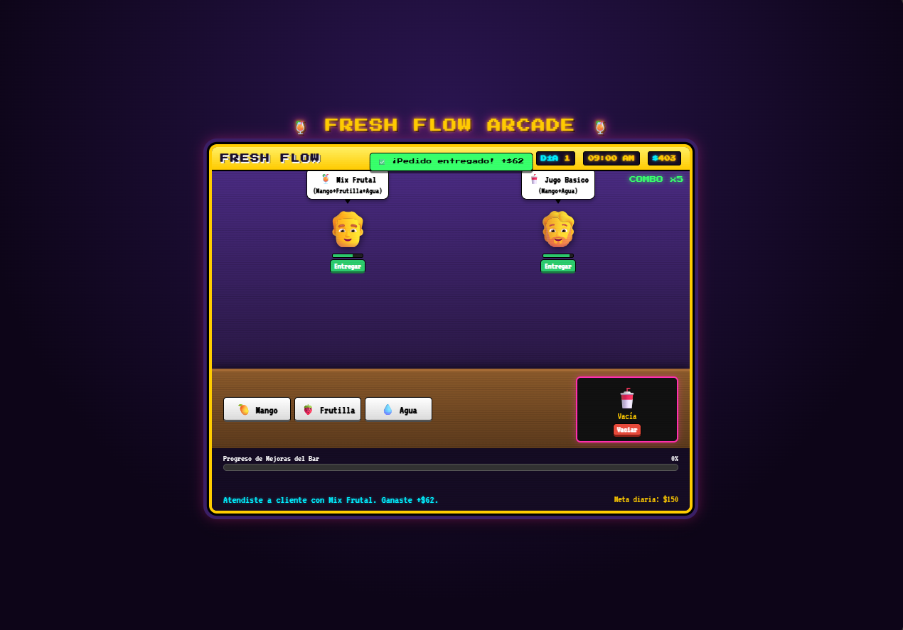
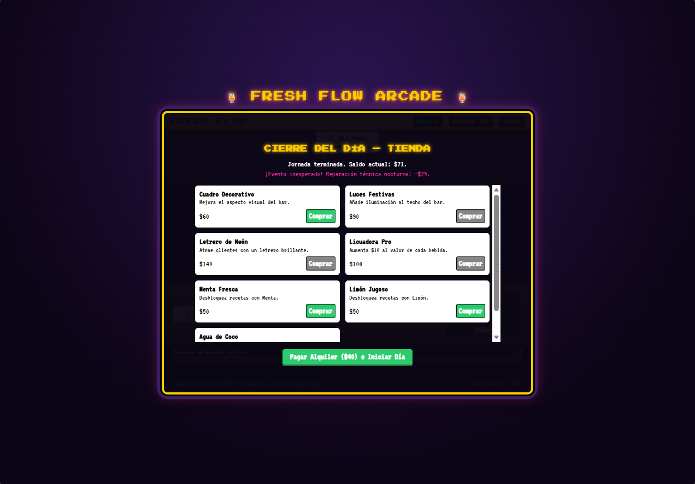

# Fresh Flow
**LINK:** https://chrischidori27-debug.github.io/Riolu-Studios/ProyectosGD/proyectos/FreshFlow.html
## Descripción
Fresh Flow es un juego de gestión y arcade ambientado en un bar/local de bebidas.

**¿De qué trata?** El jugador administra un local, preparando y entregando pedidos a los clientes para ganar dinero.

**¿Cuál es el objetivo del jugador?** Hacer crecer el negocio invirtiendo las ganancias en mejoras para atraer más clientes, hasta que el local alcance la categoría de marca internacional. Durante el juego pueden ocurrir eventos aleatorios que restan dinero.

**¿Cuál es la mecánica principal?** Preparar las bebidas solicitadas por cada cliente, entregarlas a tiempo, pagar el alquiler diario y decidir en qué mejoras invertir el dinero ganado en la tienda del local.

## Género
Strategy

## Controles
* MOUSE / CLICK - Preparar bebidas, entregar pedidos, comprar mejoras y avanzar de día

## Capturas de pantalla

### Gameplay - Mecánica principal

### Tienda / mejoras del local

