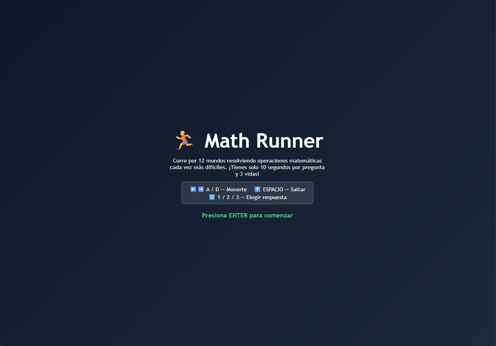
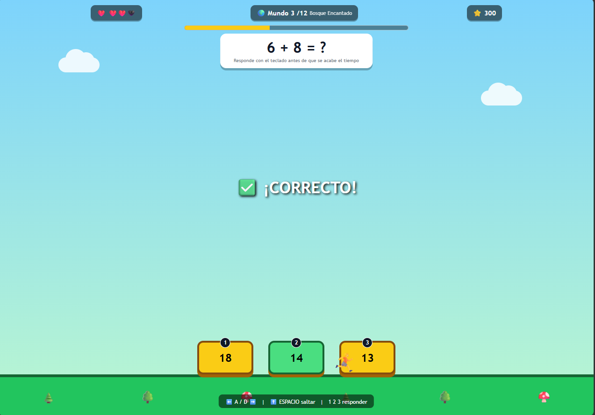

# Math Runner
**LINK:** https://chrischidori27-debug.github.io/Riolu-Studios/ProyectosGD/proyectos/math_runner.html  
## Descripción
Math Runner es un juego de plataformas en el que el jugador avanza a través de 12 mundos con temáticas distintas (bosque, desierto, montaña, galaxia) resolviendo operaciones aritméticas cada vez más difíciles.

**¿De qué trata?** El personaje corre automáticamente mientras en pantalla aparece una operación matemática junto a tres posibles resultados representados como plataformas.

**¿Cuál es el objetivo del jugador?** Elegir la plataforma con la respuesta correcta antes de que se agote el tiempo (10 segundos por pregunta) para sumar puntos y avanzar de mundo. El jugador pierde cuando se queda sin las 3 vidas disponibles.

**¿Cuál es la mecánica principal?** Resolver la operación mostrada y saltar/seleccionar la plataforma con el resultado correcto; cada mundo superado incrementa la dificultad de las operaciones y el multiplicador de puntaje.

## Género
Puzzle

## Controles
* A / ← - Moverse a la izquierda
* D / → - Moverse a la derecha
* SPACE / W / ↑ - Saltar
* 1, 2, 3 - Seleccionar la respuesta correcta (izquierda, centro, derecha)

## Capturas de pantalla

### Pantalla inicial

### Gameplay - Mecánica principal

