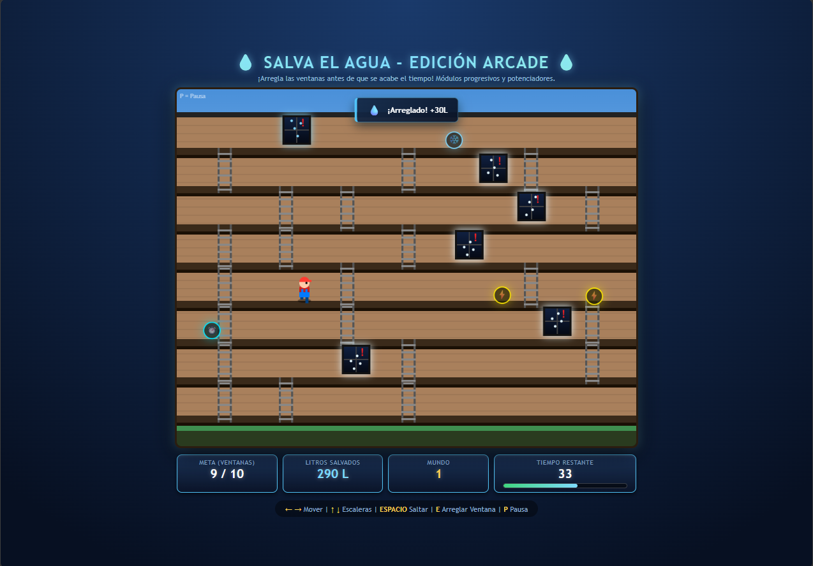

# Reparalo Quispe

## Descripción
Reparalo Quispe es un juego de plataformas inspirado en el minijuego "Repara Félix Jr." de la película *Ralph, el Demoledor*.

**¿De qué trata?** El personaje recorre las ventanas de un edificio de departamentos donde hay tuberías rotas que están desperdiciando agua.

**¿Cuál es el objetivo del jugador?** Cumplir la cuota de reparaciones de cada nivel para avanzar al siguiente mundo, cada vez con mayor dificultad.

**¿Cuál es la mecánica principal?** Desplazarse por los pisos del edificio, subir y bajar por escaleras, y acercarse a las ventanas problemáticas para repararlas, aprovechando los potenciadores que caen en el mapa.

## Género
Platformer

## Controles
* ← - Moverse a la izquierda
* → - Moverse a la derecha
* ↑ / ↓ - Subir / bajar por las escaleras
* SPACE - Saltar
* E - Reparar la tubería/ventana
* P - Pausa

## Capturas de pantalla

### Pantalla inicial

### Gameplay - Mecánica principal

